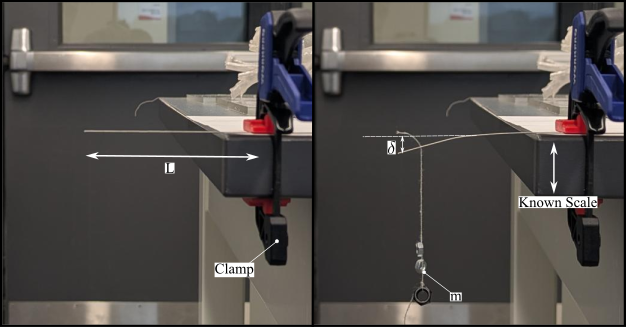

# Cantilever Beam Test for Young's Modulus

This guide details a simple experimental method to determine the Young's Modulus ($E$) of a thin, flexible wire (such as a medical guidewire) using the cantilever beam test.

The experiment involves clamping one end of the wire (the cantilever), applying a known force (a small weight) to the free end, and precisely measuring the resulting deflection.

---

## Theory and Formulas

Young's Modulus ($E$) is a fundamental property of a material that measures its stiffness. In a cantilever beam setup, it is calculated by rearranging the standard beam deflection formula to solve for $E$.

### Main Formula

The formula for Young's Modulus based on a point load at the end of a cantilever beam is:

$$E = \frac{F \cdot L^3}{3 \cdot \delta \cdot I}$$

### Component Formulas

To use the main formula, you must first calculate the **Force ($F$)** and the **Area Moment of Inertia ($I$)**.

**1. Force ($F$)**
The force is the weight applied to the tip, which is its mass ($m$) multiplied by the acceleration due to gravity ($g \approx 9.81 \text{ m/s}^2$).

$$F = m \cdot g$$

**2. Area Moment of Inertia ($I$)**
For a solid circular wire, the area moment of inertia depends on its diameter ($d$).

$$I = \frac{\pi \cdot d^4}{64}$$

where,
| Symbol | Name | Description | Units (SI) |
| :--- | :--- | :--- | :--- |
| **$E$** | **Young's Modulus** | The material's stiffness. This is what we are solving for. | Pascals (Pa) or GPa |
| **$F$** | **Force** | The downward force applied by the hanging mass. | Newtons (N) |
| **$L$** | **Length** | The free length of the wire from the clamp edge to the point where the force is applied. | meters (m) |
| **$\delta$** | **Deflection** | The vertical distance the tip of the wire bends. | meters (m) |
| **$I$** | **Area Moment of Inertia** | A geometric property of the wire's circular cross-section. | meters to the 4th ($m^4$) |
| **$d$** | **Diameter** | The diameter of the wire. | meters (m) |
| **$m$** | **Mass** | The mass of the weight hung from the tip. | kilograms (kg) |
| **$g$** | **Gravity** | Acceleration due to gravity. | $m/s^2$ |

All measurements should be converted to standard SI Units (meters, kilograms, Newtons) before being used in the formulas.

---

## Experimental Procedure

This procedure uses a camera to accurately measure the tiny deflection.

### Materials
* Wire sample
* Rigid clamp
* Precision micrometer (to measure diameter)
* A set of small, known masses (e.g., 1g, 2g)
* Phone camera with a stable tripod
* High-contrast background (e.g., a white sheet of paper)
* Image analysis software (like ImageJ)

### Steps
1.  **Measure Diameter:** Use a micrometer to get a precise measurement of the wire's diameter ($d$).
2.  **Clamp Wire:** Securely clamp the wire horizontally to a bench or table. Ensure the clamp has a sharp edge so the starting point is clear.
3.  **Measure Length:** Measure the free, cantilevered length ($L$) from the clamp's edge to the wire's tip.
4.  **Set Up Camera:** Position the camera on the tripod so it is perpendicular to the wire and can see the tip. Place the ruler in the frame, parallel to the wire, for scale.
5.  **Take Reference Image:** Take a clear, in-focus photo of the setup **before** adding any weight. This is your `reference.png`.
6.  **Apply Load:** Carefully hang a known mass ($m$) from the very end of the wire.
7.  **Take Deflection Image:** Once the wire stops moving, take a second photo. **without moving the camera.** This is your `deflected.png`.
8.  **Analyze Images:**
    * Load both images into your analysis software.
    * **Calibrate Scale:** Use the ruler in the image to find the pixel-to-mm ratio (e.g., `1.45 pxl/mm`).
    * **Measure Deflection:** Measure the vertical distance in pixels ($\delta_{px}$) between the wire's tip in `reference.png` and `deflected.png`.
    * **Convert Deflection:** Use your ratio to convert the pixel deflection into millimeters, and then into meters ($\delta$).
9.  **Repeat:** Repeat steps 6-8 with a few different masses to get an average value for $E$, which improves accuracy.

## 🧮 Calculation Example

Consider the setup in the figure below:
 

### 1. Given Data & SI Conversions

First, list all initial measurements and immediately convert them to standard SI units (meters, kilograms, Newtons) to avoid errors.

* **Gravity ($g$):** $9.81 \text{ m/s}^2$
* **Pixel/mm Ratio:** $1.45 \text{ pxl/mm}$

| Parameter | Symbol | Measurement | SI Unit Conversion |
| :--- | :--- | :--- | :--- |
| **Length** | $L$ | $60 \text{ mm}$ | **$0.060 \text{ m}$** |
| **Diameter** | $d$ | $0.64 \text{ mm}$ | **$0.00064 \text{ m}$** |
| **Mass 1** | $m_1$ | $1.44 \text{ g}$ | **$0.00144 \text{ kg}$** |
| **Deflection 1** | $\delta_{px1}$ | $14.362 \text{ pxl}$ | $14.362 / 1.45 = 9.905 \text{ mm}$ $\rightarrow$ **$0.009905 \text{ m}$** |
| **Mass 2** | $m_2$ | $2.29 \text{ g}$ | **$0.00229 \text{ kg}$** |
| **Deflection 2** | $\delta_{px2}$ | $22.504 \text{ pxl}$ | $22.504 / 1.45 = 15.52 \text{ mm}$ $\rightarrow$ **$0.01552 \text{ m}$** |

---

### 2. Calculate Constant: Area Moment of Inertia ($I$)

This geometric property is the same for all tests on this wire.

* $I = \frac{\pi \cdot d^4}{64}$
* $I = \frac{\pi \cdot (0.00064 \text{ m})^4}{64}$
* $I = \mathbf{8.236 \times 10^{-15} \text{ m}^4}$

---

### 3. Calculation for Test1 (m1 = 1.44 g)

* **Step 3a: Find Force ($F_1$)**
    $$F_1 = m_1 \cdot g = 0.00144 \text{ kg} \cdot 9.81 \text{ m/s}^2 = \mathbf{0.01413 \text{ N}}$$

* **Step 3b: Solve for Young's Modulus ($E_1$)**
    $$E_1 = \frac{F_1 \cdot L^3}{3 \cdot \delta_1 \cdot I}$$
    $$E_1 = \frac{0.01413 \text{ N} \cdot (0.060 \text{ m})^3}{3 \cdot 0.009905 \text{ m} \cdot 8.236 \times 10^{-15} \text{ m}^4}$$
    $$E_1 = \frac{3.052 \times 10^{-6}}{2.448 \times 10^{-16}}$$
    $E_1 = 12,467,320,261 \text{ Pa}$ $\rightarrow$ **$12.47 \text{ GPa}$**

Averaging the results from multiple weights provides a more reliable final value.